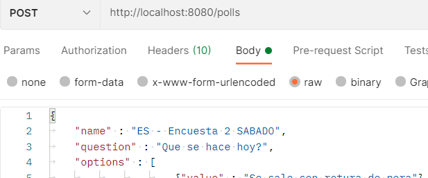

# quick-poll

 

# Introduction to REST

## What is REST?

---

* REST stands for REpresentational State Transfer

* architectural style for designing distributed network applications
* coined by Roy Fielding
* has 6 principles:
	1. Client-Server 
	2. Stateless 	
	3. Layered System
	4. Cache			
	5. Uniform Interface
	6. Code on demand

### 1. Client-Server
Concerns should be separated between clients and servers.

### 2. Stateless
Server need not remember the state of the client. The clients must include all of the necessary information in the request so that server can understand and process it.

### 3. Layered System
Gateways, firewalls, and proxies can exist between client and server. Layers can be added, modified, reordered, or removed transparently to improve scalability.

### 4. Cache
Responses from the server must be declared as cacheable or noncacheable. Responses are cached and thay can be reused for later requests. This reduces the load on the server.

### 5. Uniform Interface
All interactions are based on the uniformity of their interfaces. Components can evolve independently as long as they implement the agreed-on contract. 

> The Uniform Interface constraint is a key feature that distinguishes REST applications from other network-based applications.

Uniform Interface in a REST application is achieved through abstractions such as resources, representations, URIs, and HTTP methods

### 6. Code on demand
Clients can extend their functionality by downloading and executing code on demand. 

## Understanding Resources

---

A resource is anything that can be accessed or manipulated.

For example, “videos,” “blog entries,” “user profiles,” “images,” and even tangible things such as persons or devices. 

It is also possible for a resource to be grouped into collections.

### Identifying Resources

---

> URI: Uniform Resource Identifier

For uniquely identifying resources the Web provides URI 

Sintax:
	
	scheme:scheme-specific-part

scheme -> http or ftp or mailto, etc

| URI											| Resource Description				|
|-----------------------------------------------|-----------------------------------|
|http://blog.example.com/posts					| collection of blog post resources	|
|http://blog.example.com/posts/1				| 1st post							|
|http://blog.example.com/posts/1/comments		| collection of comments of 1st post|
|http://blog.example.com/posts/1/comments/245	| 245th comment of 1st post			|

URI aliases is used to refer to such URIs that identify the same resources.

### URI Templates

---

URI templates, defined in RFC 6570 (http://tools.ietf.org/html/rfc6570), provide a standardized mechanism for describing URI structure.

It would be convenient for a consuming client to know the URI structure http://blog.example.com/{year}/posts, for example to retrieve all 2013 and 2014 posts:
- http://blog.example.com/2013/posts
- http://blog.example.com/2014/posts

> URL templates allow the server code to parse and retrieve the values of the variables or selected portions of URI easily.

## Representation

---

RESTful resources are abstract entities. 

Data and metadata that make a RESTful resource needs to be serialized into a representation before it gets sent to a client

This representation can be viewed as a snapshot of a resource’s state at a given point in time.

XML or JSON format.

he clients didn’t interact with the actual resource—the database record-holding product details. Instead, they dealt with its representation.

> REST components interact with a resource by transferring its representations back and forth. They never directly interact with the resource.

It is possible for the client to request a particular representation and this process is termed as content negotiation. 

Two possible content negotiation strategies:
- Postfixing the URI with the desired representation

	in *JSON* format: http://www.example.com/products/143.json

	in *XML* format: http://www.example.com/products/143.xml

- Using the Accept header

	Clients can populate the HTTP Accept header with the desired representation and send it along with the request.

## HTTP Method

---

### Safety

	Safe methods used to retrieve information/resources from the server, the operations are read-only
### Idempotency
### GET
### HEAD
### DELETE
### PUT
### POST
### 
PATCH

## 
## 

# Representation

 
 
 
 
 
 
 
 
 
 
 
 

## ResponseEntity

	Extension of HttpEntity that adds a HttpStatus status code.
***
Applications that adhere to these constraints are considered to be RESTful
***
 
 
 
 

El orden que va tomar se produce en el mapeo de la entidad, viene question, name, etc.

Si vemos el POST que realiza, pasamos name, question, etc y sin embargo se conserva el orden question, name, etc.

##